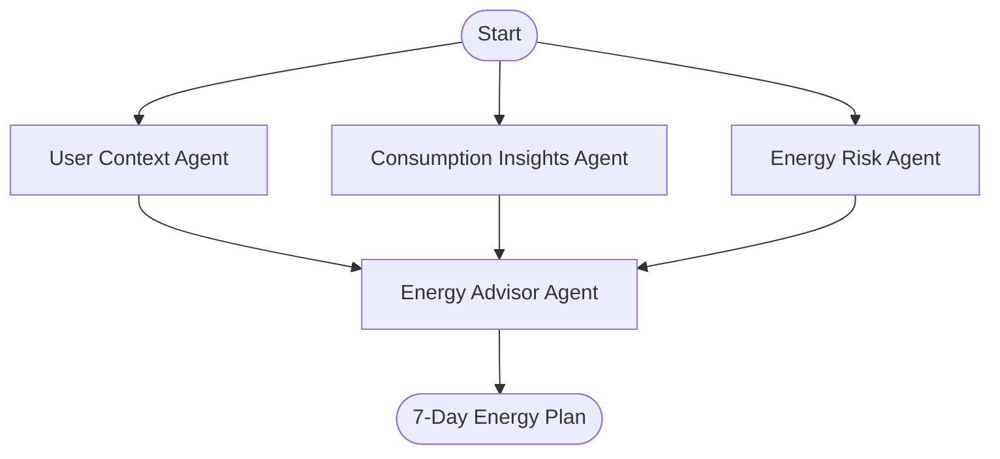

# ⚡ Insight-Watt: Intelligent Energy Advisor

**Insight-Watt** is an advanced AI backend system designed to move beyond passive energy monitoring. Instead of just displaying charts, it acts as an intelligent consultant, predicting future usage and providing actionable, personalized advice to reduce electricity bills.

---

## 🚀 Key Features

*   **7-Day AI Forecast**: Uses LightGBM (Gradient Boosting) models to predict hourly energy consumption for the next week with high accuracy.
*   **Multi-Agent Reasoning**: A LangGraph-orchestrated system where specialized agents (Context, Insights, Risk) collaborate to understand the *why* behind the usage.
*   **Real-Time Weather Adaptation**: Fetches live weather data (Temperature, Humidity, Wind) from Open-Meteo to adjust predictions on the fly.
*   **Generative AI Advice**: Uses Google Gemini to synthesize data into a polite, human-readable 7-day energy saving plan.

---

## 🏗️ Architecture

The system follows a **Fan-Out / Fan-In** agent workflow:



1.  **Consumption Insight Agent**: Analyzes historical patterns (Peak hours, Weekend vs Weekday behavior, Weather correlation).
2.  **User Context Agent**: Parses user lifestyle questionnaires (Occupancy, HVAC preferences).
3.  **Energy Advisor Agent**: The final synthesizer that uses LLMs (Gemini) to generate the final advice.

---

## 📂 Project Structure

```
Insight-Watt-Backend/
├── agents/                  # The "Brain" of the system
│   ├── main_graph.py        # LangGraph Orchestrator (The wiring)
│   ├── state.py             # Data schema flowing between agents
│   └── all_agent/           # Individual Agent Logic
│       ├── consumption_insight_agent.py
│       ├── energy_advisor_agent.py
│       ├── user_context_agent.py
│       └── energy_risk_agent.py
├── backend/                 # Backend Services
│   └── services/
│       └── forcast_engine.py # LightGBM Model + Open-Meteo Integration
├── ML/                      # Machine Learning Assets
│   └── outputs/models/      # Saved .joblib models
├── data/                    # Data Storage
│   └── raw/houses/          # Historical CSV data
├── main.py                  # Entry point for testing the flow
└── requirements.txt         # Python dependencies
```

---

## 🛠️ Setup & Installation

1.  **Clone the Repository**
    ```bash
    git clone https://github.com/your-repo/insight-watt.git
    cd insight-watt
    ```

2.  **Create a Virtual Environment**
    ```bash
    py -m venv venv
    .\venv\Scripts\Activate  # Windows
    # source venv/bin/activate  # Mac/Linux
    ```

3.  **Install Dependencies**
    ```bash
    pip install -r requirements.txt
    ```

4.  **Environment Variables**
    Create a `.env` file in the root directory and add your keys:
    ```ini
    GEMINI_API_KEY=your_google_gemini_key_here
    ```

---

## 🏃 Usage

To run the full agent workflow with sample data:

```bash
python main.py
```

To run just the Forecasting Engine (Weather + Prediction):

```bash
python backend/services/forcast_engine.py
```

---

## 🧠 Technologies
*   **Orchestration**: LangGraph
*   **LLM**: Google Gemini 1.5 Flash
*   **Forecasting**: LightGBM
*   **Data Processing**: Pandas, NumPy
*   **Weather**: Open-Meteo API
